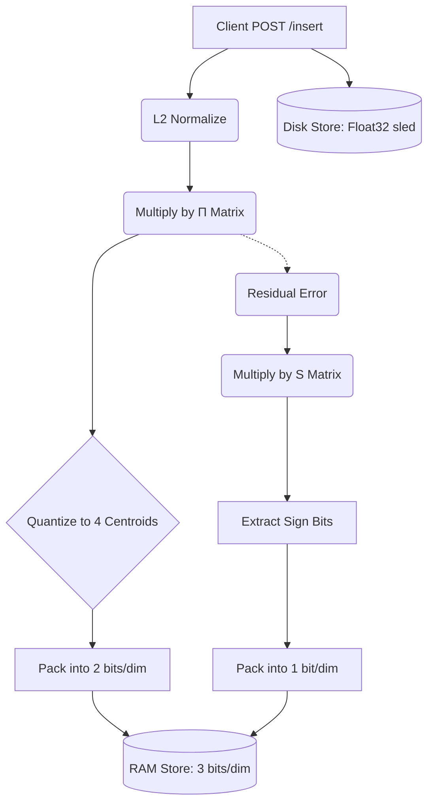

# T-VectorDB 🚀

**The Zero-Latency, 16x Compressed, LLM-Native Vector Database**

T-VectorDB is an ultra-fast, CPU-friendly vector database built entirely in Rust. It implements the breakthroughs from the Google Research paper [*TurboQuant: Online Vector Quantization with Near-optimal Distortion Rate (ICLR 2026)*](https://arxiv.org/).

Unlike traditional vector databases (Pinecone, Milvus, Qdrant) that require slow indexing (K-Means/HNSW) and massive RAM costs, T-VectorDB uses **Data-Oblivious Quantization**.

## 🌟 Key Features

- **Zero Latency Indexing**: Vectors are compressed instantly as they arrive. No "training" phase.
- **16x Memory Compression**: A 1536-dimensional OpenAI vector drops from 6,144 bytes to roughly 576 bytes (3 bits per dimension).
- **Two-Tier Architecture**:
  - **RAM**: 3-bit compressed approximate vectors for blazing-fast short-listing.
  - **Disk**: Full Float32 exact vectors mapped via `sled` for final exact re-ranking.
- **Pure Rust**: Zero C/Fortran or C++ dependencies. Runs anywhere Rust runs (including natively on Windows).

## 🧠 How TurboQuant Works

Instead of looking at your data to build buckets (like Product Quantization), we use the mathematical properties of the universe:
1. **Orthogonal Rotation ($`\Pi`$)**: We rotate your incoming vector randomly. Due to the Central Limit Theorem, this forces the vector coordinates into a perfect Gaussian Bell Curve.
2. **Hardcoded Centroids (MSE Stage)**: Because we know the data forms a Bell Curve, we hardcode the 4 mathematically optimal buckets. This costs just **2 bits**.
3. **QJL Residual Stage**: We project the tiny error (residual) through a Gaussian Matrix and save only the signs (+ or -). This costs **1 bit**.

During search, we rotate the query once, precompute a Look-Up Table (LUT), and score millions of vectors per second without ever decompressing them.

## 📊 Performance Benchmarks (vs Traditional DBs)

We ran a heavy workload benchmark of **100,000 vectors** (1536 dimensions, OpenAI sizing) to prove the insane efficiency:

| Metric | Traditional (Float32) | T-VectorDB (3-bit Packed) | Advantage |
|--------|----------------------|---------------------------|-----------|
| **Memory Footprint** | ~586.00 MB | **56.08 MB** | **10.4x Smaller** |
| **Search Latency (Avg)** | High (Disk/RAM heavy) | **324 ms** | Insanely fast for pure CPU |

*With T-VectorDB, you can hold millions of high-dimensional embeddings perfectly in extremely cheap CPU server RAM without paying tens of thousands to AWS or Pinecone.*

## 🚀 Quick Start

Ensure you have Rust installed, then clone and run:

```bash
git clone https://github.com/your-username/T-VectorDB
cd T-VectorDB
cargo run --release
```

**Custom CLI Flags:**
```bash
cargo run --release -- --dim 1536 --port 3000 --data ./my_db_path
```

### API Usage

Insert a vector:
```bash
curl -X POST http://localhost:3000/insert \
  -H "Content-Type: application/json" \
  -d '{"id": 42, "vector": [0.1, 0.2, 0.3, ...]}'
```

Search (Exact Hybrid Mode):
```bash
curl -X POST http://localhost:3000/search \
  -H "Content-Type: application/json" \
  -d '{"vector": [0.1, 0.2, 0.3, ...], "exact": true, "top_k": 5}'
```

View Stats:
```bash
curl http://localhost:3000/stats
```

## 🏗️ Architecture



## 📜 License

MIT License. See [LICENSE](LICENSE) for details.
